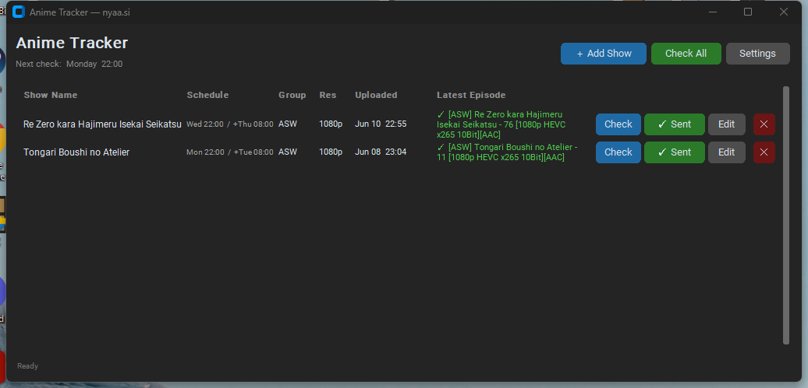

# Anime Tracker

A fast, dark-mode Windows desktop app that tracks the anime you're watching, checks [nyaa.si](https://nyaa.si) for new episodes on each show's airing schedule, and sends them to your torrent client with one click.



## Features

- **Per-show schedules** — set the airing day & time; the app checks automatically, plus a +10 hour fallback check for late uploads
- **NEW episode detection** — remembers what you've already downloaded and flags anything newer with `● NEW`
- **One-click download** — works with **any torrent client** (qBittorrent, Deluge, Transmission, uTorrent…) via the system magnet-link handler, no setup needed
- **qBittorrent power mode** — optional Web UI integration adds torrents silently with a category and save path, and even auto-launches qBittorrent if it's closed
- **Auto-refresh on launch** — never shows stale results; covers checks missed while the app was closed
- **Configurable release group & resolution** per show (defaults to ASW 1080p)
- **Honest error states** — distinguishes "no release found" from "nyaa.si unreachable"
- Window size/position remembered between sessions, keyboard shortcuts (`Ctrl+N` add show, `F5` check all)

## Getting started

### Download (no install)

Grab the latest **[AnimeTracker-v1.0-Windows.zip](https://github.com/xrich8x/anime-tracker/releases/latest)** from Releases, extract the whole folder, and run `AnimeTracker.exe` — no Python required. (Windows SmartScreen may warn on first launch since the app isn't code-signed; click *More info → Run anyway*.)

### Run from source

```
pip install -r requirements.txt
python anime_tracker.py
```

Requires Python 3.10+ on Windows.

### Build a standalone EXE

```
pip install pyinstaller
pyinstaller --onedir --windowed --name AnimeTracker anime_tracker.py
```

The app lands in `dist/AnimeTracker/` — run `AnimeTracker.exe` from there (the `_internal` folder must stay beside it). `--onedir` is used instead of `--onefile` because it starts much faster (no temp extraction on every launch).

## Usage

1. **＋ Add Show** — enter the show name as it appears in nyaa.si release titles, its airing day/time, resolution, and release group.
2. The app checks each show at its scheduled time (and again 10 hours later as a fallback). **Check All** / `F5` refreshes everything on demand.
3. When an episode you haven't grabbed appears, it's flagged **● NEW** — hit **Download**. The button flips to **✓ Sent** so you always know what you've already grabbed.

### Torrent client setup

By default, Download hands the magnet link to whatever torrent client is registered on your system — if you can click magnet links in a browser, it just works.

For silent adds with a category and save path, open **Settings** and switch to **qBittorrent Web UI** mode (enable it in qBittorrent under *Tools → Options → Web UI* first).

## Data files

The app stores its data next to the EXE (or script):

| File | Contents |
|------|----------|
| `shows.json` | Your tracked shows and their latest results |
| `settings.json` | Download mode, qBittorrent credentials, window geometry |
| `tracker.log` | Errors and diagnostics |

## Tech

Python · [customtkinter](https://github.com/TomSchimansky/CustomTkinter) UI · feedparser (nyaa RSS) · requests (qBittorrent Web API v2) · schedule · PyInstaller
